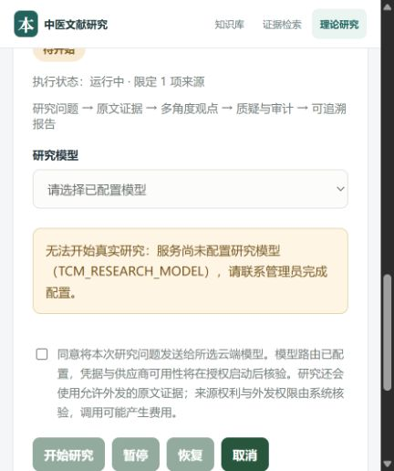

# 方剂学核心流程接续演示：停在真实研究启动

2026-10-01；分支 `codex/evidence-audit`，HEAD `7b27043`。用户要求“继续演示核心流程并记录问题”。既有代码和数据保留，本轮只改演示记录、队列和交接，没有修复业务代码。

## 材料与运行条件

- 入口 `http://127.0.0.1:18067/?workspace=knowledge`；复用 `tcm_vib62_workspace_test`，真实 API、知识发布 Worker，无模型替身。
- 原服务已退出。本轮前端构建通过；已有启动器连接 Docker 受沙箱限制，经自动审批恢复成功。仅使用 Linux 容器 Python，没有启动 Windows Python/uv/Alembic。
- 启动器会话 `49123`，仍运行；如需结束，向该会话输入 `stop`。没有更改模型、外发策略或凭据。
- 原来源“方剂学（麻黄汤与大青龙汤研究）” `SRC-01a0f5ce-fd1e-761e-bb62-0e354f91a350`，选择已解析修订 **2**。未重复导入、未改修订1及其候选。
- 原问题：两方组成/证候/配伍比较，大青龙汤为何倍用麻黄。源文件现代括注为9g/12g，研究问题要求区别古方三两/六两与现代克数。

## 实际页面操作与结果

| 步骤 | 操作与证据 | 实际结果 |
| --- | --- | --- |
| 原文阅读 | 选修订2，加载后续段落3次，定位两方；逐段打开正文 | 首段“经过长期”连续；正文不再父子重复 |
| 麻黄汤证据 | 勾选逻辑段656、658、661、663、666、671、675、679，即阅读段157～164 | 连续8段创建完整证据成功；上文《伤寒论》，下文【附方】 |
| 大青龙汤证据 | 勾选750、752、757、759、761、764、767、771、774、779、786、790、795、799、805，即阅读段180～194 | 连续15段创建成功；包含组成、证治机理、方解、鉴别与完整柯琴方论 |
| 文本核对 | 读取原文件，对两方选定范围逐字比较，忽略排版空白；同时查看证据修订、上下文和定位 | 两项均一致，见 `source-fidelity.json`；由当前操作者在页面提交文本核对说明，不冒充医学专家 |
| 知识整理 | 各自以已核对证据建立名称“麻黄汤”“大青龙汤”，类型为概念OTHER，再批量审核名称 | 两条名称保存、审核成功；说明中记录手工入口缺方剂类型的限制，未填结构化方剂组成 |
| 本地入库 | 创建已审核快照→发布并构建索引 | 版本2自动成为当前版本；24证据、3概念、0关系/药物/方剂（包含此前已审内容）；全文可用、向量不适用、无模型调用 |
| 检索 | 大青龙汤、麻黄汤、火星土壤矿物成分；最后重复大青龙汤 | 分别1、2、0、1条已发布证据；目标结果来自本来源修订2，本地通道明确 |
| 引用溯源 | 从大青龙汤检索结果打开详情→打开来源文献 | 详情准确；回跳失败，先落到质量发布页，手动切到原文又停在首段，未定位180～194或高亮 |
| 研究创建 | 从检索结果“以此来源开展研究”，限定原来源，填写问题并创建 | 任务 `RT-01a0f690-2bea-7fc1-aa32-347c177acf1b` 已保存，待开始 |
| 研究启动 | 查看模型选择及“开始研究” | 模型选项为空、按钮禁用，提示未配置 `TCM_RESEARCH_MODEL`；未勾外发同意、未创建研究执行Job |
| 刷新与重开 | 刷新研究页、自动恢复会话，手动重选新任务，打开研究报告 | 任务仍存在，问题和1项来源保留；选中任务/详情页不自动恢复；最终报告尚未生成 |

知识发布任务：`JOB-01a0f68e-a58e-72af-985f-f9ddc11548f4`；页面完成、尝试1/3。版本2编号（质量记录显示）：`01a0f68e-7a84-72be-ab15-6b495da0ef60`。大青龙汤证据 `EV-01a0f68d-647a-78cf-8b60-1d51bd1adb64@1`，指向来源修订2。

## 问题清单与归属

| 编号 | 归属/程度 | 可复现问题 | 后续处理 |
| --- | --- | --- | --- |
| D94-01 | VIB-89 / 阻断溯源验收 | 检索详情“打开来源文献”沿用之前publish页；原文页首段，无目标加载/高亮；回跳只传来源编号 | 传来源修订、精确段范围；强制原文页、按需加载并高亮，保存返回位置。入口EvidenceDrawer.tsx、main.tsx、KnowledgeWorkspace.tsx |
| D94-02 | VIB-92 / 环境阻断 | 当前服务未配置研究模型；页面禁止启动，符合门禁，但没有页面内配置/修复入口 | 在既有授权范围内核对模型配置、来源授权、凭据和费用后启动已保存任务；不得用假模型/旧报告替代 |
| D94-03 | VIB-93 / 状态误导 | 同一任务显示“待开始”和“执行状态：运行中”；无模型时外发文案仍说“模型路由已配置” | 区分control_state ACTIVE与实际执行；按能力状态显示文案 |
| D94-04 | VIB-93 / 页面恢复 | 刷新只恢复任务列表，当前任务及详情标签清空，需要手动重选 | 保存当前task_id和标签；新任务可重开不等于位置自动恢复 |
| D94-05 | VIB-90 / 整理入口限制 | 手工知识类型只有概念/药物，无方剂；本轮名称只能建为OTHER，快照方剂数仍0 | 补足与当前材料匹配的方剂编辑/核对入口，不能以概念名称宣称完整方剂结构化验收 |
| D94-06 | VIB-89、VIB-93 / 阅读负担 | 长文只有逐批加载，无正文检索或目标段跳转；详情/检索恢复物理换行，句中空格；位置仍有path/physical_lines和JSON | 增加正文定位，复用阅读格式，技术位置收进详情。完整引文没有丢字，格式问题与截断区分 |
| D94-07 | VIB-93 / 质量页负担 | 查询大青龙汤后质量页显示27条RETRIEVAL_UNPUBLISHED_EXACT_V1警告及原始JSON；检索页面只显示1条已发布结果 | 为未入库原文候选提供可理解的处理提示和摘要；是否应生成这些记录、是否重复增长尚未诊断，不能据此宣称泄漏未审核证据 |

材料限制单独记录：原文件麻黄汤“三两(9g)”、大青龙汤“六两(12g)”与方解“倍用麻黄”同时存在。这是原文记载，不是解析新增错误；不得静默改为18g或将现代克数直接解释为两倍。未核实教材版次/版权或外发授权，研究启动仍需核验。

## 验证范围、证据与接续

- 本轮 **npm run build通过**；`git diff --check`通过。实际页面验证上述步骤；未改业务代码，没有重跑后端单元/集成测试。
- 本轮真实云调用 **0次**；未完成两场景研究、报告、导出或全链重复演示。VIB-94仍未验收，VIB-93仍In Progress，VIB-89/90/91/92不能据本轮标Done。
- 页面留在新建研究的模型阻断处；服务和数据保留。浏览器刷新后可从任务列表选择公开编号对应任务。
- 截图/DOM/逐段读文保存在 `docs/acceptance-artifacts/vib94-fangji-continued/`。`published-version.png`、`citation-return.png`、`research-model-blocker.png`分别对应发布、回跳失败和启动阻断；完整操作文本与原文件一致性结果同目录。
- 下一条具体操作：先按D94-01补引用目标传递与高亮，复测本次大青龙汤证据；真实研究配置恢复后重开上述任务继续，不重复创建证据/概念/快照。配置恢复不代表已核验授权或费用。

